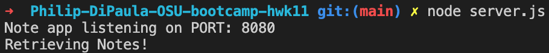
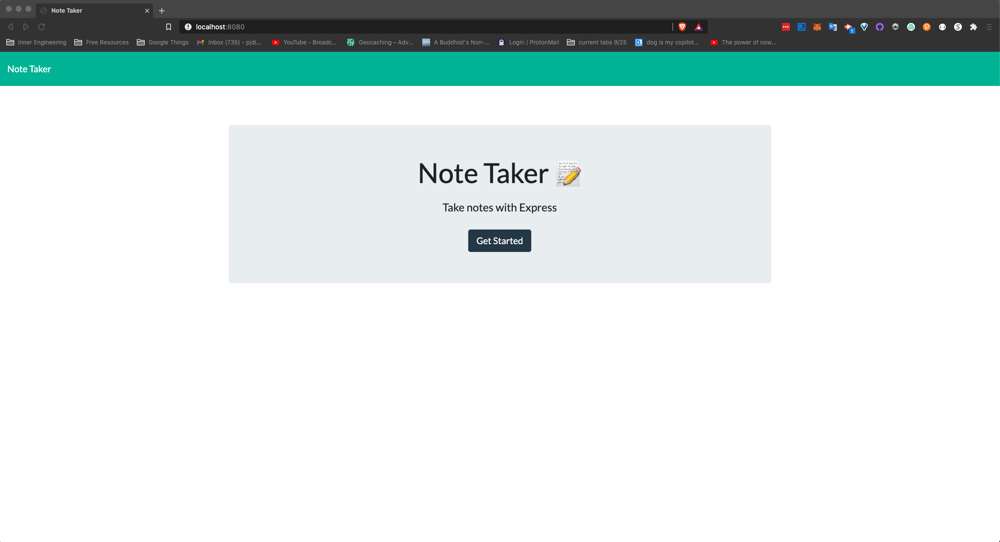
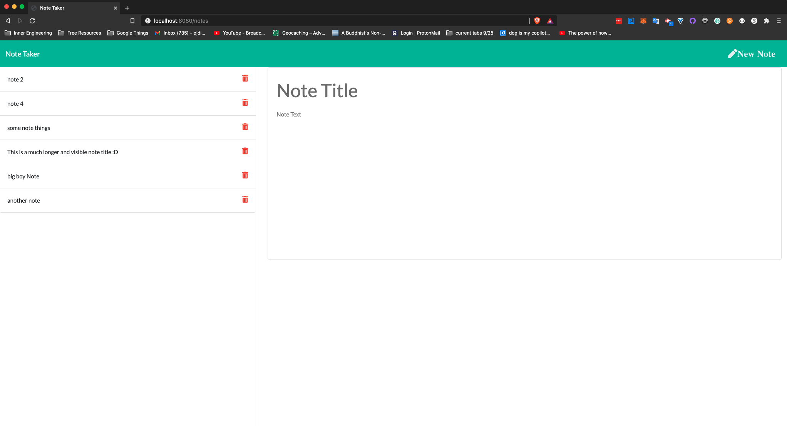
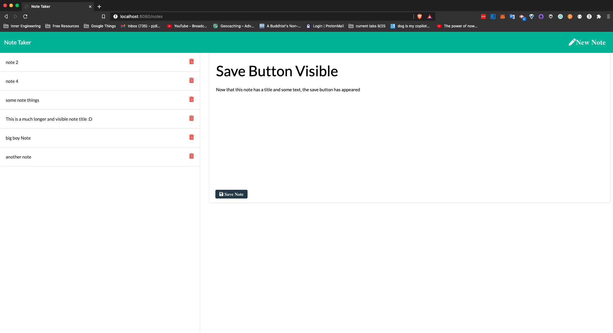
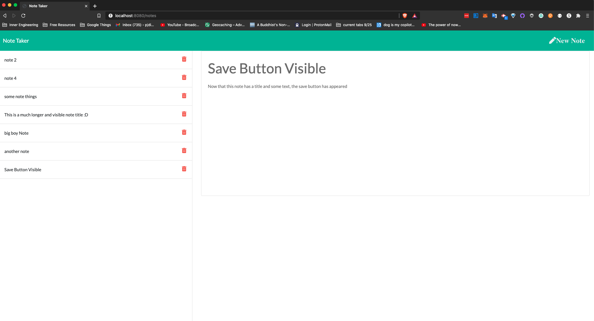

# Philip-DiPaula-OSU-bootcamp-hwk11

## These are the files for the homework assignment associated with section 11 of the OSU Web Development Bootcamp

Here is a link to the [github](https://github.com/pjdip/Philip-DiPaula-OSU-bootcamp-hwk11)

The goal of this assignment was to create an application that can be used to write, save, and delete notes using the [Express package](https://www.npmjs.com/package/express) to construct the backend. Note data is stored in and retrieved from a JSON file using the built-in [fs package](https://nodejs.org/api/fs.html). Users have the ability to write and save notes, as well as view and delte previously saved notes.

* [Installation](#installation)
* [Usage](#usage)
* [Credits](#credits)
* [Badges](#badges)
* [License](#license)

## Installation

Installation requirements include node.js and express.js
You will find package dependency .json files in github repo that should allow express to work without any further effort on your end. You will need to install node on your own. Installation options for node can be found [here](https://nodejs.org/en/download/)

## Usage 

In order to use this application, first clone the repo to your local machine. Then use the command line to navigate to the main folder containing server.js. Once you have node installed, you should be able to start the server using the command 'node server.js'. If you are successful, there will be a console.log statement alerting you that the app is listening on port 8080. If you have any troubles running the application, try doing 'npm install' from the main folder and then try again.

Once you have the server running, if you go to your browser and head to the address "http://localhost:8080/" you should be presented with the home page of the app. If you click the "Get Started" button, you will be taken to where the magic happens. In the top right corner is a button that will allow you to start a fresh note. Once you type in a title and some text in your note, a "Save Note" button will appear (this button will only appear once the note has both a title and some text in the body of the note). When clicked, it will store the note in the backend of the application and display it on the left side of the screen. Initially you will have no saved notes, but once you save your first note, you will be able to view it on the left side of the screen where all save notes will be listed. Each saved note can be clicked in order to view it and has a trash can icon which can be used to delete the note. 

Here are some screenshots:

Server Success: 
Home Page: 
Initial Note Page: 
Making a Note: 
Viewing a Note: 

## Credits

Special Thanks to Express documentation:
* [npm](https://www.npmjs.com/package/express)
* [docs](https://expressjs.com/en/guide/routing.html)

Thanks to [stackoverflow](https://stackoverflow.com/questions/1349404/generate-random-string-characters-in-javascript) for some tips on easily creating a random id using crypto

Thanks to [Scott Robinson](https://stackabuse.com/reading-and-writing-json-files-with-node-js/) for a quick and easy primer on using the fs package for reading/writing JSON files

Special Thanks to Node.js documentation for info on the intricacies of some built-in packages:
* [fs](https://nodejs.org/api/fs.html)
* [crypto](https://nodejs.org/api/crypto.html)
* [path](https://nodejs.org/api/path.html)

Special Thanks to [ChilledCow](https://www.youtube.com/channel/UCSJ4gkVC6NrvII8umztf0Ow) for providing chill lofi beats to code to

## Badges

## License

Licensed under the [GNU General Public License v3.0](https://choosealicense.com/licenses/gpl-3.0/)

---